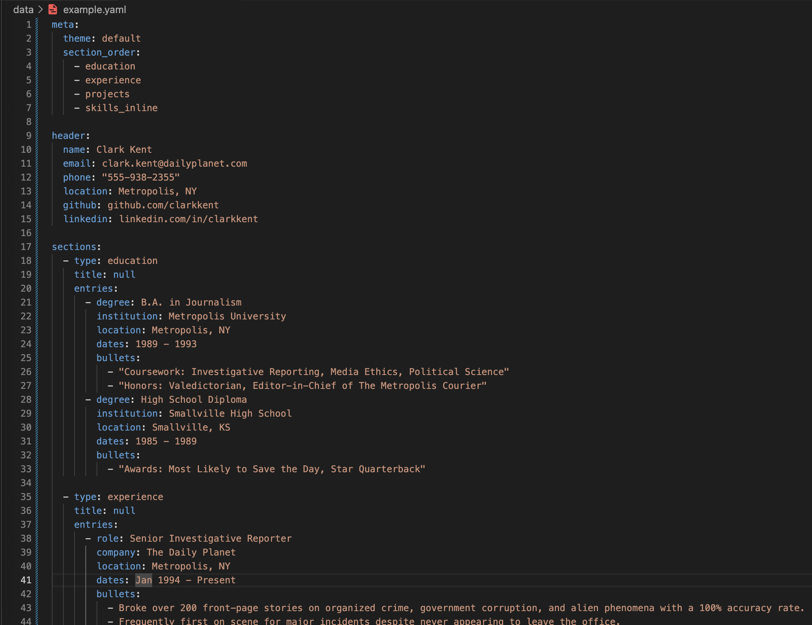
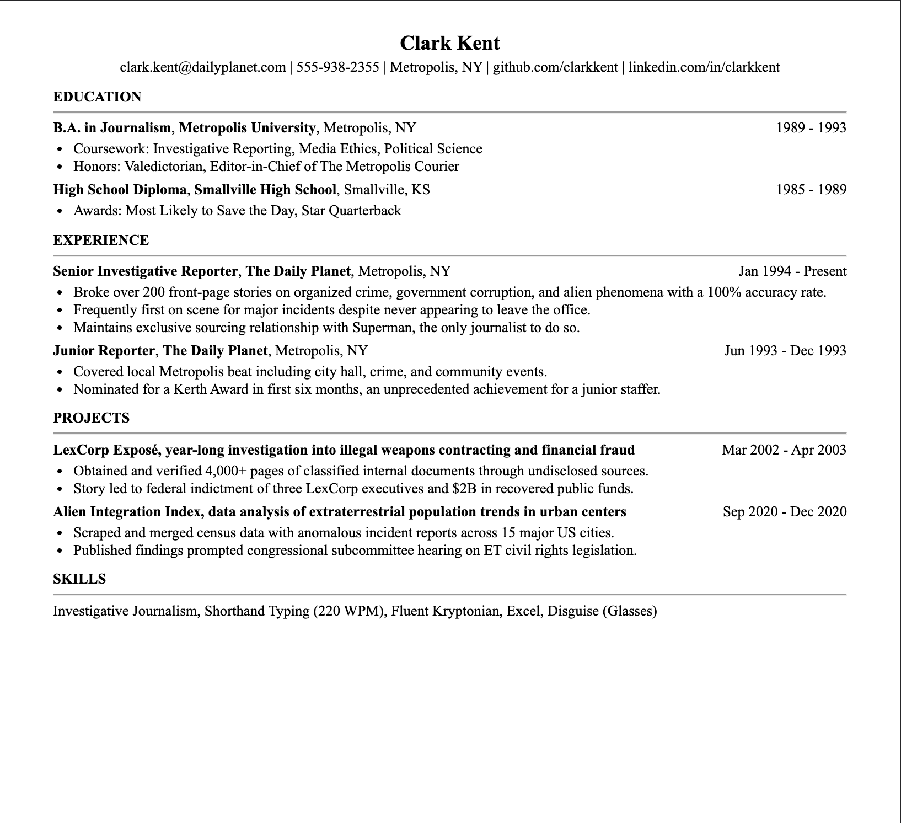

# easy-resume

> QUICK NOTE: I made this befoer finding RenderCV, which is a way more mature and functional version of this project. If you are looking for a robust and extensible way to generate PDF resumes from YAML, consider checking them out. This repository will likely not be getting any more theme or formatting updates.

Generate a formatted resume PDF from a YAML file.

| YAML                                | PDF                                 |
| ----------------------------------- | ----------------------------------- |
|  |  |


## Installation

```bash
git clone https://github.com/r0hankrishnan/easy-resume
cd easy-resume

python -m venv .venv
source .venv/bin/activate  # Windows: .venv\Scripts\activate

pip install -e .
playwright install chromium
```

## Usage

```bash
easy-resume path/to/resume.yaml
```

Output files are written next to the input file by default. Use `--output` to specify a different directory:

```bash
easy-resume path/to/resume.yaml --output path/to/output/dir
```

## Resume Format

Resumes are written in YAML. See `data/example.yaml` for a full example. The basic structure:

```yaml
meta:
  theme: default
  section_order:
    - education
    - experience
    - projects
    - skills_inline

header:
  name: Clark Kent
  email: clark.kent@dailyplanet.com
  phone: "555-938-2355"      # optional
  location: Metropolis, NY
  github: github.com/clarkkent  # optional
  linkedin: linkedin.com/in/clarkkent  # optional

sections:
  - type: education
    entries:
      - degree: B.A. in Journalism
        institution: Metropolis University
        location: Metropolis, NY
        dates: 1989 - 1993
        bullets:
          - "Coursework: Investigative Reporting, Media Ethics"

  - type: experience
    entries:
      - role: Senior Investigative Reporter
        company: The Daily Planet
        location: Metropolis, NY
        dates: January 1994 - Present
        bullets:
          - Broke over 200 front-page stories on organized crime and corruption.

  - type: projects
    entries:
      - name: "LexCorp Exposé, year-long investigation into illegal weapons contracting"
        dates: March 2002 - April 2003
        bullets:
          - Led to federal indictment of three executives and $2B in recovered funds.

  - type: skills_inline
    entries:
      - skills:
          - Python
          - SQL
          - Investigative Journalism
```

## Supported Section Types

| Type | Required Fields |
|------|----------------|
| `education` | `degree`, `institution`, `location`, `dates` |
| `experience` | `role`, `company`, `location`, `dates`, `bullets` |
| `projects` | `name`, `dates`, `bullets` |
| `skills_inline` | `skills` |

All section types accept an optional `title` field to override the default heading.