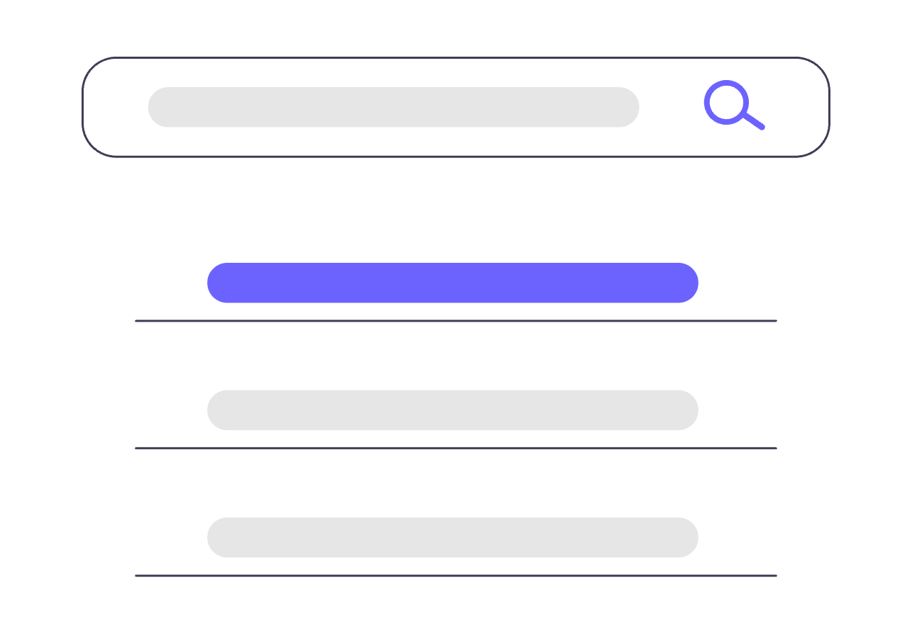

# This is a header

## This is a subheader

Here is some normal text. I'll also include *italics*,  **bold**, and a [link](https://www.google.com)

How about unordered lists:

- Item 1
- Item 2
- Item 3

And ordered lists:

1. Ordered Item 1
2. Ordered Item 2
3. Ordered Item 3

Now a table:

| Column 1 | Column 2 | Column 3 |
|----------|----------|----------|
| Row 1    | Row 2    | Row 3    |
| Row 4    | Row 5    | Row 6    | 

Finally, a picture:

